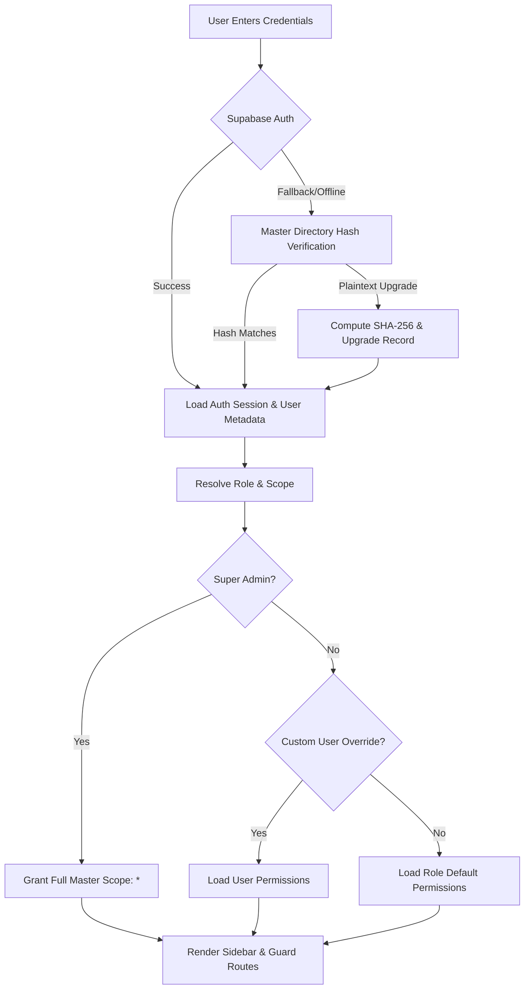
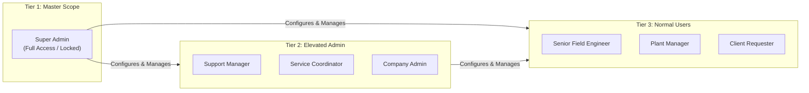
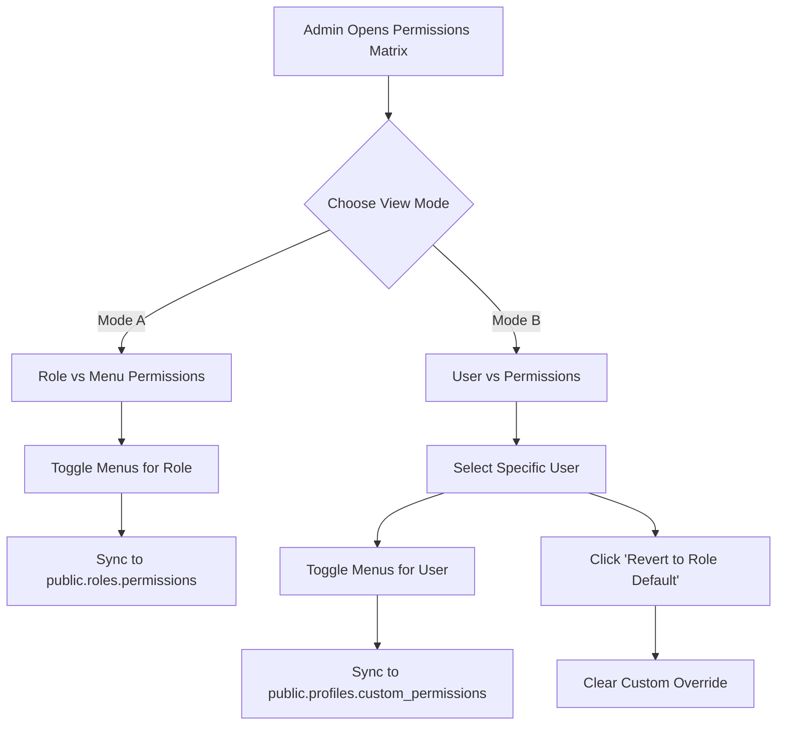
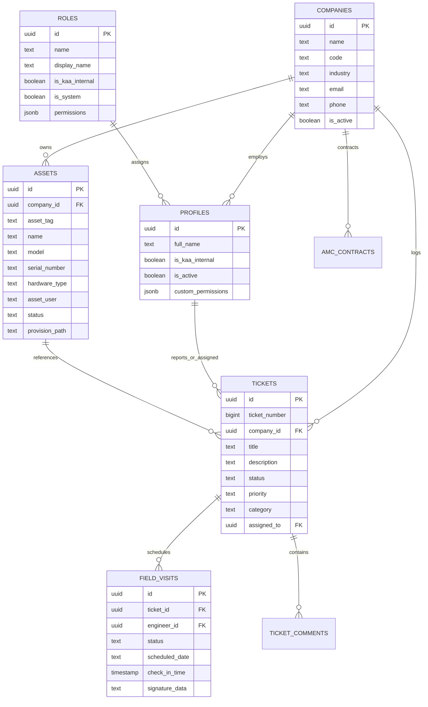

# KAA Support Portal — Complete Architecture & Feature Specification

**Project Identity:** KAA Support Portal  
**System Type:** Enterprise Multi-Tenant ERP & Field Service Operations Management Platform  
**Target Enterprise Client Tenant:** ISS Global Forwarding W.L.L  
**Version:** 2.4.0 (Late September 2026 Stable Release)  
**Document Classification:** Comprehensive System & Architecture Specification  

---

## 📋 Table of Contents
1. [Executive Overview & Business Objectives](#1-executive-overview--business-objectives)
2. [Full Technology Stack & Architecture](#2-full-technology-stack--architecture)
3. [Security Architecture, Authentication & Cryptography](#3-security-architecture-authentication--cryptography)
4. [Three-Tier User & Role Hierarchy](#4-three-tier-user--role-hierarchy)
5. [The "User vs Permission" Matrix System](#5-the-user-vs-permission-matrix-system)
6. [Complete Menu-by-Menu Feature Breakdown](#6-complete-menu-by-menu-feature-breakdown)
   - [6.1 Overview: Dashboard (`/dashboard`)](#61-overview-dashboard-dashboard)
   - [6.2 Support Desk: Tickets (`/tickets`)](#62-support-desk-tickets-tickets)
   - [6.3 Support Desk: Raise Ticket (`/tickets/new`)](#63-support-desk-raise-ticket-ticketsnew)
   - [6.4 Support Desk: Engineers (`/engineers`)](#64-support-desk-engineers-engineers)
   - [6.5 Support Desk: Field Visits (`/field-visits`)](#65-support-desk-field-visits-field-visits)
   - [6.6 Assets & Contracts: Machinery Assets (`/assets`)](#66-assets--contracts-machinery-assets-assets)
   - [6.7 Assets & Contracts: AMC Contracts (`/amc`)](#67-assets--contracts-amc-contracts-amc)
   - [6.8 Administration & Masters: Company Master (`/admin/masters?tab=companies`)](#68-administration--masters-company-master-adminmasterstabcompanies)
   - [6.9 Administration & Masters: Admin Masters (`/admin/masters`)](#69-administration--masters-admin-masters-adminmasters)
   - [6.10 Administration & Masters: Reports & Analytics (`/reports`)](#610-administration--masters-reports--analytics-reports)
   - [6.11 Administration & Masters: Portal Settings (`/settings`)](#611-administration--masters-portal-settings-settings)
   - [6.12 Help & Knowledge: Knowledge Base (`/knowledge-base`)](#612-help--knowledge-knowledge-base-knowledge-base)
7. [Database Schema & Cloud Synchronization Model](#7-database-schema--cloud-synchronization-model)
8. [File Structure & Repository Layout](#8-file-structure--repository-layout)
9. [Deployment, Environment & Build Runbook](#9-deployment-environment--build-runbook)

---

## 1. Executive Overview & Business Objectives

The **KAA Support Portal** is an enterprise-grade ERP, ticketing, asset lifecycle, and field engineering platform built for industrial automation and multi-tenant service operations.

The platform bridges internal operations (service managers, coordinators, and field engineers) with external client organizations (such as **ISS Global Forwarding W.L.L**), providing:
* **Multi-Tenant Data Isolation**: Complete segregation of client tickets, machinery assets, and service contracts using PostgreSQL Row Level Security (RLS).
* **Equipment & Hardware Master Management**: Lifecycle tracking of industrial assets (PLCs, VFDs, robotic units, sensors, and office hardware), including serial numbers, warranties, user assignments, and provisioning documents.
* **Rapid Ticketing & SLA Tracking**: Complete triage workflow from ticket creation, file attachment uploads, engineer assignments, and resolution audits.
* **On-Site Field Operations**: GPS-confirmed engineer check-ins, on-site diagnostics, digital customer sign-offs via touch/mouse signature canvas, and automated PDF service report generation.
* **Maintenance Contracts (AMC)**: SLA policy enforcement, annual visit quota allocation, and labor coverage verification.
* **Granular Role & User Permission Matrix**: A 3-tier access control system enabling administrators to toggle which navigation menus appear on each user's screen.

---

## 2. Full Technology Stack & Architecture

### 2.1 Frontend Framework & Build Pipeline
* **Core Runtime**: React 18.3 with TypeScript 5.5+ for strict type safety.
* **Bundler & Dev Server**: Vite 8.2 (ESM-based HMR, sub-4 second production bundling).
* **Routing**: React Router DOM v6 with declarative routing, nested layouts, lazy-loaded page modules, and dynamic `PermissionRoute` guards.
* **Styling & Design System**: Tailwind CSS v3 with custom design tokens, modern dark/light mode themes, and CSS variables.
* **UI Components**: Headless primitives from Radix UI (`@radix-ui/react-dialog`, `@radix-ui/react-tabs`, `@radix-ui/react-dropdown-menu`, `@radix-ui/react-tooltip`, `@radix-ui/react-select`, `@radix-ui/react-switch`) customized into Shadcn-style components.
* **Icons**: Lucide React (`lucide-react`) with dynamic icon mapping.
* **Forms & Validation**: React Hook Form with Zod schema validation (`@hookform/resolvers/zod`).
* **Toast Notifications**: Sonner rich toast notifications (`sonner`) with custom theme and status styling.
* **Data Fetching & Cache**: TanStack React Query v5 for asynchronous caching, revalidation, and optimistic mutations.

### 2.2 Client-Side State Management Architecture
The portal utilizes Zustand stores designed for offline resilience, persistence, and automated cloud synchronization:

1. **`useAuthStore`** (`src/stores/auth-store.ts`):
   * Tracks authenticated user session, tokens, company scope, role designation, and active role tier.
   * Houses the dynamic `hasMenuAccess(menuId: string)` engine that drives sidebar visibility and route guards.
   * Persisted via Zustand `persist` in `localStorage` under `kaa-auth-storage`.
2. **`useMasterStore`** (`src/stores/master-store.ts`):
   * Central offline-first repository for Companies, Users, Hardware Types, Assets, AMC Contracts, Tickets, Field Visits, Spare Parts, KB Articles, Role Permissions, and User Custom Overrides.
   * Implements automated cloud synchronization (`syncFromSupabase`) connecting directly to live PostgreSQL tables.
   * Contains real-time mock data filters (`cleanMockFilter` and `purgeMockData`) to eliminate mock or legacy entries.
   * Persisted in `localStorage` under `kaa-master-storage`.
3. **`useUIStore`** (`src/stores/ui-store.ts`):
   * Tracks sidebar collapse state, theme toggle (Dark / Light), and global view options.

### 2.3 Backend & Cloud Architecture (Supabase)
* **Database Engine**: Managed PostgreSQL 15 on Supabase (`pqiboqctyzvjdxqtxilp.supabase.co`).
* **Authentication**: Supabase Auth (JWT-based session authentication with `raw_user_meta_data`).
* **Stored Procedures & RPCs**:
  * `admin_create_user`: Secure user creation, Bcrypt password encryption, profile creation, and tenant linking.
  * `get_users_directory`: Assembles user profiles, roles, and company affiliations for directory tables.
  * `get_user_company`: Resolves tenant isolation scope for client logins.
* **Storage Buckets**:
  * `ticket-attachments`: Public/authenticated file storage for ticket photos, logs, and diagnostic files.
  * `asset-provisions`: Storage for equipment commissioning sheets and handover receipts.

---

## 3. Security Architecture, Authentication & Cryptography



### 3.1 Dual-Phase Authentication & Cryptographic Fallback
1. **Primary Authentication (Supabase Auth)**:
   * The user enters their email and password. `supabase.auth.signInWithPassword()` authenticates credentials against the PostgreSQL `auth.users` table using salted Bcrypt encryption.
2. **Cryptographic Fallback (Master Directory)**:
   * If Supabase Auth is unreachable or the user was onboarded via the local master store, credentials are verified using the browser Web Cryptography API (`crypto.subtle.digest('SHA-256')`).
   * Plaintext passwords from onboarding are automatically migrated and upgraded to SHA-256 cryptographic hashes immediately upon the first successful sign-in.

### 3.2 Inactivity Auto-Logout Safeguard
* Implemented via `useInactivityTimer` (`src/hooks/useInactivityTimer.ts`).
* Tracks mouse movement, key presses, scrolling, and clicks.
* Automatically terminates user sessions and returns to the login screen after **10 minutes of inactivity** to prevent unauthorized access at unattended terminals.

### 3.3 Content Security Policy (CSP) & Accessibility Compliance
* **Zero Script Evaluation**: No usage of `eval()`, `new Function()`, or dynamic code execution, ensuring strict adherence to enterprise Content Security Policies.
* **Standardized Form Attributes**: All interactive inputs, dropdowns, and checkboxes across all 19 screens possess explicit `id`, `name`, and `<label htmlFor>` associations for browser autofill and WCAG 2.1 AA accessibility compliance.

---

## 4. Three-Tier User & Role Hierarchy



The portal establishes a strict **3-Tier Role Structure**:

### Tier 1: Master Scope (Super Admin)
* **Role**: `Super Admin`
* **Account Scope**: `KAA Internal Staff`
* **Privilege Level**: Permanent, unrestricted master scope across all modules (`*`).
* **Governance**: Menus cannot be revoked or disabled. Toggles are permanently locked in the permissions matrix with a protected badge to prevent accidental self-lockout.

### Tier 2: Elevated Admin (Managerial)
* **Roles**:
  * `Support Manager` (Internal Staff): Manages internal service rosters, engineer assignments, and core registries.
  * `Service Coordinator` (Internal Staff): Schedules and triages field visits, tracks technician dispatch, and reviews ticket queues.
  * `Company Admin` (Client User): Tenant administrator for client organizations (e.g. ISS Global Forwarding W.L.L), with visibility over organization-wide tickets, assets, and service contracts.
* **Governance**: Super Admin can customize which menus each admin role or individual user can access.

### Tier 3: Normal Users (Operational)
* **Roles**:
  * `Senior Field Engineer` (Internal Staff): Executes on-site maintenance, completes GPS check-ins, captures customer sign-offs, and inspects equipment.
  * `Plant Manager` (Client User): Tracks plant machinery uptime, AMC contract quotas, and raises equipment service requests.
  * `Client Requester` (Client User): Standard client employee authorized to report issues and view their own tickets.
* **Governance**: Configurable by Admins and Super Admin.

---

## 5. The "User vs Permission" Matrix System

The permission engine allows both **Role-Level Defaults** and **Individual User Overrides**, giving administrators absolute control over portal navigation.



### 5.1 Controlled Navigation Menus (12 Total)
1. `dashboard`: Overview & Operations KPI Summary
2. `tickets`: Support Desk Ticket List & Details
3. `tickets_new`: Raise New Support Ticket
4. `engineers`: Engineering Directory & Workload
5. `field_visits`: Field Visits & On-Site Service Logs
6. `assets`: Machinery & Equipment Registry
7. `amc`: Annual Maintenance Contracts
8. `company_master`: Client Tenant Onboarding
9. `admin_masters`: Central Entity & Core System Registries
10. `reports`: SLA Compliance & Performance Analytics
11. `settings`: Portal Settings & Configuration
12. `knowledge_base`: Technical Manuals & SOPs

### 5.2 Factory Default Permission Matrix

| Menu Module | Super Admin | Support Manager | Service Coordinator | Company Admin | Field Engineer | Plant Manager | Client Requester |
| :--- | :---: | :---: | :---: | :---: | :---: | :---: | :---: |
| **Dashboard** | ✅ | ✅ | ✅ | ✅ | ✅ | ✅ | ✅ |
| **Tickets** | ✅ | ✅ | ✅ | ✅ | ✅ | ✅ | ✅ |
| **Raise Ticket** | ✅ | ✅ | ✅ | ✅ | ❌ | ✅ | ✅ |
| **Engineers** | ✅ | ✅ | ✅ | ❌ | ❌ | ❌ | ❌ |
| **Field Visits** | ✅ | ✅ | ✅ | ❌ | ✅ | ❌ | ❌ |
| **Machinery Assets** | ✅ | ✅ | ✅ | ✅ | ✅ | ✅ | ❌ |
| **AMC Contracts** | ✅ | ✅ | ✅ | ✅ | ❌ | ✅ | ❌ |
| **Company Master** | ✅ | ✅ | ❌ | ❌ | ❌ | ❌ | ❌ |
| **Admin Masters** | ✅ | ✅ | ❌ | ❌ | ❌ | ❌ | ❌ |
| **Reports** | ✅ | ✅ | ✅ | ✅ | ❌ | ❌ | ❌ |
| **Settings** | ✅ | ❌ | ❌ | ❌ | ❌ | ❌ | ❌ |
| **Knowledge Base** | ✅ | ✅ | ✅ | ✅ | ✅ | ✅ | ✅ |
| **Total Enabled** | **12 / 12** | **11 / 12** | **9 / 12** | **7 / 12** | **5 / 12** | **6 / 12** | **4 / 12** |

---

## 6. Complete Menu-by-Menu Feature Breakdown

---

### 6.1 Overview: Dashboard (`/dashboard`)
* **Primary Route**: `/dashboard`
* **Target Audience**: All authenticated users (scoped by tenant and role).
* **Core Capabilities**:
  * **Real-Time KPI Cards**:
    * *Total Active Tickets*: Live count of tickets currently open or in-progress.
    * *SLA Breached*: Immediate counter for tickets that exceeded contractual resolution windows.
    * *Active Equipment*: Total machinery assets registered under the user's company scope.
    * *AMC Contracts Active*: Active maintenance coverage status.
    * *Field Visits in Progress*: Real-time count of on-site visits underway.
  * **Interactive Operations Charts**:
    * Monthly ticket volume trends.
    * Category distribution breakdown (PLC, Robotics, Hydraulics, Hardware).
    * SLA Adherence rate gauge.
  * **Direct Quick-Action Hub**:
    * `Raise Ticket`: Direct jump to ticket creation.
    * `Register Asset`: Quick mapping modal for new machinery.
    * `Admin Masters`: Instant link to central registries for administrators.
    * `Manage Companies`: Direct link to company tenant onboarding.
  * **Recent Activity Feed**: Timeline of ticket updates, field visit check-ins, and asset updates.

---

### 6.2 Support Desk: Tickets (`/tickets`)
* **Primary Route**: `/tickets`
* **Detail Route**: `/tickets/:id`
* **Kanban Route**: `/tickets/kanban`
* **Core Capabilities**:
  * **Multi-View Modes**:
    * *Table View*: Sortable columns for Ticket #, Title, Customer Company, Priority, Status, Assignee, and Date.
    * *Kanban Board*: Drag-and-drop or categorized columns (*Open*, *Assigned*, *In Progress*, *Resolved*, *Closed*).
  * **Search & Multi-Facet Filtering**: Filter tickets by status, priority (*Low*, *Medium*, *High*, *Critical*), category, and assigned engineer.
  * **Ticket Detail Screen (`/tickets/:id`)**:
    * Real-time conversation thread with internal notes vs client-facing replies.
    * SLA countdown timer and breach warnings.
    * Equipment tag linkage (displays linked hardware specs and warranty).
    * File attachment previews and direct download links.
    * Status transition workflow with automated audit logging.

---

### 6.3 Support Desk: Raise Ticket (`/tickets/new`)
* **Primary Route**: `/tickets/new`
* **Core Capabilities**:
  * **Structured Submission Form**:
    * Ticket title and detailed problem description.
    * Customer organization selection (auto-locked to the user's company for client users).
    * Equipment Asset selector (dynamically loads machinery registered to the selected company).
    * Priority selection with visual SLA indicators (*Emergency / Critical: 4hr response*, *High: 8hr*, *Medium: 24hr*, *Low: 48hr*).
    * Hardware Category selection.
  * **File Attachment Upload**:
    * Direct file upload into Supabase Storage (`ticket-attachments` bucket).
    * Supports images, error screenshots, diagnostic logs, and PDF schematics.
    * File validation (file size limits, accepted MIME types).

---

### 6.4 Support Desk: Engineers (`/engineers`)
* **Primary Route**: `/engineers`
* **Target Audience**: Internal Support Managers and Service Coordinators.
* **Core Capabilities**:
  * **Engineer Roster**: Cards for all internal field engineers.
  * **Skill Specializations**: Badges for PLC programming, Robotics, Hydraulics, VFD diagnostics, and Electrical wiring.
  * **Workload & Availability Status**: Real-time status indicators (*Available*, *On-Site*, *In Transit*, *On Leave*).
  * **Active Ticket Assignments**: Overview of active jobs assigned to each engineer.
  * **Direct Contact Shortcuts**: One-click phone and email communication.

---

### 6.5 Support Desk: Field Visits (`/field-visits`)
* **Primary Route**: `/field-visits`
* **Core Capabilities**:
  * **Visit Dispatch Registry**: Tracks all scheduled, in-progress, and completed on-site technician dispatches.
  * **GPS Check-In Verification**: Verifies technician presence on-site with geolocation coordinates and timestamping.
  * **Digital Customer Signature Canvas**:
    * Interactive HTML5 signature pad supporting finger or mouse signatures.
    * Captures customer signer's full name and exact signing timestamp.
    * Saved directly as a secure base64/PNG record in the visit data.
  * **Automated PDF Service Report Generation**:
    * Generates a branded, printable Customer Service Report PDF.
    * Includes ticket number, company name, technician name, equipment serial number, work description, parts used, and the customer's digital signature.

---

### 6.6 Assets & Contracts: Machinery Assets (`/assets`)
* **Primary Route**: `/assets`
* **Core Capabilities**:
  * **Complete Equipment Registry**: Tracks asset tag (`AST-2026-XXX`), equipment name, model number, serial number, hardware category, warranty expiration date, and AMC status.
  * **"Edit Asset & Reassign User" Feature**:
    * Edit modal allowing updates to equipment name, model, serial number, status, and remarks.
    * **User Reassignment Dropdown**: Reassign equipment ownership to any active employee within the tenant organization (e.g. assigning a laptop or PLC to another ISS Global Forwarding staff member).
  * **Excel / Spreadsheet Bulk Import (`AssetExcelImportModal`)**:
    * Import multiple equipment assets in bulk via `.xlsx` or `.csv` files.
    * Provides a downloadable template matching database fields.
    * Auto-validates columns and inserts records into the database.
  * **Asset Provision Document Attachment**: Upload equipment commissioning sheets and handover receipts directly to Supabase Storage (`asset-provisions` bucket).

---

### 6.7 Assets & Contracts: AMC Contracts (`/amc`)
* **Primary Route**: `/amc`
* **Core Capabilities**:
  * **Contract Portfolio Tracker**: Manages Annual Maintenance Contracts across client companies.
  * **Visit Quota Tracking**: Visual progress bars showing total allocated annual maintenance visits vs consumed visits.
  * **Coverage Terms**: Validates labor inclusion flags, parts coverage, and emergency callout terms.
  * **Contract Validity**: Highlights active, expiring soon (within 30 days), and expired contracts.

---

### 6.8 Administration & Masters: Company Master (`/admin/masters?tab=companies`)
* **Primary Route**: `/admin/masters?tab=companies` (also accessible via `/companies`)
* **Core Capabilities**:
  * **Tenant Organization Onboarding**: Register new client tenant companies into the portal.
  * **Company Profile Management**: Company name, unique company code (e.g. `ISSGF`), industry classification, billing email, and contact phone.
  * **Tenant Summary Counts**: Real-time counter of total users and physical equipment assets registered under the company.
  * **Deactivation Control**: Deactivate client organizations without losing historical tickets or asset service records.

---

### 6.9 Administration & Masters: Admin Masters (`/admin/masters`)
* **Primary Route**: `/admin/masters`
* **Core Capabilities**:
  * **Central 6-Tab Master Hub**:
    1. **Companies Tab**: Full tenant onboarding and company profile registry.
    2. **Users & Roles Tab**:
       * User onboarding wizard with password provisioning.
       * Role assignment (`Super Admin`, `Support Manager`, `Service Coordinator`, `Senior Field Engineer`, `Company Admin`, `Plant Manager`, `Client Requester`).
       * Password Reset Modal with one-click temporary password generation and clipboard copy.
       * Account deactivation and activation controls.
    3. **Hardware Types Tab**:
       * Manage hardware categories (PLC, VFD, Robotics, Sensor, HMI, Network Gateway, Industrial PC).
       * Add custom hardware classifications.
    4. **Assets & Machinery Tab**: Master equipment registry with Excel Import and Edit Asset modals.
    5. **AMC Contracts Tab**: Master contract creation and visit allocation wizard.
    6. **User vs Permissions Tab**:
       * View A: Role vs Menu Permissions matrix with interactive switches.
       * View B: User vs Permissions directory with personal menu overrides and "Revert to Role Default" action.

---

### 6.10 Administration & Masters: Reports & Analytics (`/reports`)
* **Primary Route**: `/reports`
* **Target Audience**: Internal Leadership, Support Managers, and Company Admins.
* **Core Capabilities**:
  * **SLA Performance Metrics**: Overall SLA adherence rate percentage and breach breakdown.
  * **Mean Time to Resolve (MTTR)**: Average resolution duration tracked by priority and hardware category.
  * **Technician Performance**: Ticket closure rates and customer satisfaction indicators per engineer.
  * **Customer Volume Analytics**: Ticket frequency and recurring fault analysis by client company.

---

### 6.11 Administration & Masters: Portal Settings (`/settings`)
* **Primary Route**: `/settings`
* **Core Capabilities**:
  * **Appearance & Theme**: Toggle between Dark Mode and Light Mode with instant CSS variable updates.
  * **Security Settings**: Session inactivity timeout configuration and password policy enforcement.
  * **Notification Preferences**: Configure email and portal alerts for new ticket logs, SLA warnings, and field visit dispatches.

---

### 6.12 Help & Knowledge: Knowledge Base (`/knowledge-base`)
* **Primary Route**: `/knowledge-base`
* **Core Capabilities**:
  * **Searchable Documentation**: Technical manuals, standard operating procedures (SOPs), and common industrial error codes.
  * **Category Filtering**: Filter by PLC troubleshooting, motor drives, mechanical, or network configuration.
  * **Article Reader**: Full markdown formatted guides with diagnostic steps.
  * **Helpfulness Ratings**: "Was this article helpful?" voting mechanism and view count metrics.

---

## 7. Database Schema & Cloud Synchronization Model

### 7.1 Primary Database Tables (PostgreSQL / Supabase)



### 7.2 Database Table Reference

| Table Name | Description | Key Columns |
| :--- | :--- | :--- |
| `public.companies` | Client tenant organizations | `id`, `name`, `code`, `industry`, `email`, `phone`, `is_active` |
| `public.roles` | System roles & role permissions | `id`, `name`, `display_name`, `is_kaa_internal`, `permissions` (`jsonb`) |
| `public.profiles` | User profiles & user custom overrides | `id`, `full_name`, `is_kaa_internal`, `is_active`, `custom_permissions` (`jsonb`) |
| `public.user_company_access` | Tenant user mapping | `id`, `user_id`, `company_id`, `is_primary` |
| `public.asset_categories` | Hardware categories master | `id`, `name`, `icon`, `is_active` |
| `public.assets` | Equipment & physical machinery | `id`, `company_id`, `asset_tag`, `name`, `model`, `serial_number`, `asset_user`, `hardware_type`, `provision_path` |
| `public.amc_contracts` | Annual maintenance contracts | `id`, `company_id`, `contract_number`, `start_date`, `end_date`, `total_visits`, `used_visits` |
| `public.tickets` | Support desk tickets | `id`, `ticket_number`, `company_id`, `title`, `description`, `status`, `priority`, `category`, `assigned_to` |
| `public.ticket_comments` | Ticket conversation & notes | `id`, `ticket_id`, `user_id`, `content`, `is_internal` |
| `public.field_visits` | On-site technician visits | `id`, `ticket_id`, `engineer_id`, `status`, `scheduled_date`, `check_in_time`, `signature_data` |
| `public.parts` | Spare parts & inventory | `id`, `sku`, `name`, `category_id`, `unit_price`, `min_stock_level` |
| `public.kb_articles` | Knowledge base documentation | `id`, `title`, `content`, `category`, `view_count`, `helpful_count` |

---

## 8. File Structure & Repository Layout

```
KAA_TICKETS/
├── src/
│   ├── components/
│   │   ├── layout/
│   │   │   ├── DashboardLayout.tsx      # Main authenticated app frame
│   │   │   ├── Header.tsx               # Top search, theme toggle, and user profile
│   │   │   └── Sidebar.tsx              # Dynamic permission-based navigation sidebar
│   │   ├── shared/
│   │   │   ├── ErrorBoundary.tsx        # React global crash protection
│   │   │   └── PageHeader.tsx           # Standardized title & action bar
│   │   └── ui/                          # Radix / Shadcn reusable component library
│   │       ├── badge.tsx
│   │       ├── button.tsx
│   │       ├── dialog.tsx
│   │       ├── switch.tsx
│   │       ├── table.tsx
│   │       └── tabs.tsx
│   ├── features/
│   │   ├── admin/
│   │   │   ├── MastersPage.tsx          # 6-Tab Core Entity Management
│   │   │   ├── PermissionsMatrixTab.tsx # Role vs Menu & User vs Permissions UI
│   │   │   └── SettingsPage.tsx         # Portal branding & security settings
│   │   ├── amc/
│   │   │   └── AMCContractsPage.tsx     # AMC Contracts registry & visit tracker
│   │   ├── assets/
│   │   │   ├── AssetsPage.tsx           # Machinery asset cards & table
│   │   │   ├── AssetExcelImportModal.tsx# Bulk Excel spreadsheet import modal
│   │   │   └── EditAssetModal.tsx       # Asset edit & employee reassignment modal
│   │   ├── auth/
│   │   │   └── LoginPage.tsx            # Branded enterprise login screen
│   │   ├── dashboard/
│   │   │   └── DashboardPage.tsx        # Overview KPI stats, charts & quick actions
│   │   ├── engineers/
│   │   │   ├── EngineersPage.tsx        # Technician roster & specialization cards
│   │   │   └── FieldVisitsPage.tsx      # Field dispatch, GPS & customer signature
│   │   ├── knowledge-base/
│   │   │   └── KnowledgeBasePage.tsx    # Technical manuals & SOP reader
│   │   ├── reports/
│   │   │   └── ReportsPage.tsx          # SLA compliance & operations analytics
│   │   └── tickets/
│   │       ├── CreateTicketPage.tsx     # New ticket submission wizard
│   │       ├── KanbanPage.tsx           # Visual ticket workflow board
│   │       ├── TicketDetailPage.tsx     # Conversation timeline & SLA audit
│   │       └── TicketListPage.tsx       # Searchable ticket table
│   ├── hooks/
│   │   └── useInactivityTimer.ts        # 10-minute auto-logout security hook
│   ├── lib/
│   │   ├── crypto.ts                    # SHA-256 Web Cryptography functions
│   │   ├── supabase.ts                  # Supabase client initialization
│   │   └── utils.ts                     # Tailwind class merging (cn utility)
│   ├── stores/
│   │   ├── auth-store.ts                # Authentication, roles, and hasMenuAccess
│   │   ├── master-store.ts              # Offline master state & Supabase sync
│   │   └── ui-store.ts                  # Sidebar & theme state
│   ├── types/
│   │   ├── database.ts                  # PostgreSQL schema type definitions
│   │   └── permissions.ts               # Menu definitions, tiers, and role defaults
│   ├── App.tsx                          # App routing & PermissionRoute guards
│   └── main.tsx                         # React entrypoint
├── docs/
│   ├── PROJECT_DOCUMENTATION.md         # This comprehensive documentation file
│   └── RELEASE_NOTES_PERMISSIONS_SEP_2026.md
├── package.json
├── tailwind.config.js
├── tsconfig.json
└── vite.config.ts
```

---

## 9. Deployment, Environment & Build Runbook

### 9.1 Environment Configuration (`.env`)
The portal requires the following environment variables:
```env
VITE_SUPABASE_URL=https://pqiboqctyzvjdxqtxilp.supabase.co
VITE_SUPABASE_ANON_KEY=eyJhbGciOiJIUzI1NiIsInR5cCI6IkpXVCJ9...
```

### 9.2 Development & Build Commands
```bash
# Install all dependencies
npm install

# Start local development server with Hot Module Replacement
npm run dev

# Execute strict TypeScript validation and production build
npm run build

# Preview production build locally
npm run preview
```

### 9.3 Build Verification
* The project compiles cleanly with **0 TypeScript errors** (`tsc -b && vite build`).
* Output assets are optimized and minified into `dist/` with Gzip compression support.

---

*Document compiled and verified for KAA Support Portal — Enterprise ERP & Service Operations.*
